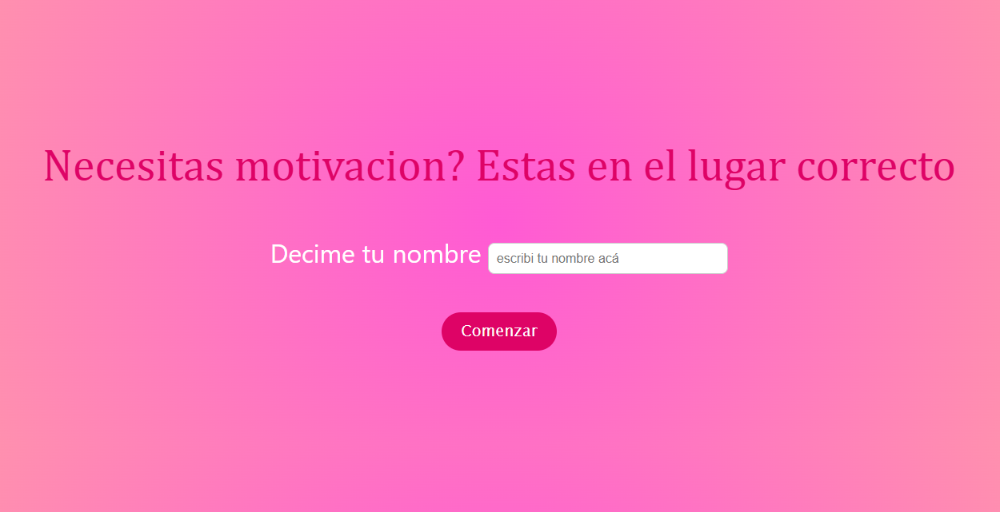

# Frases Motivacionales 
Esta es una página web simple que te da una frase motivacional aleatoria usando tu nombre, haciéndola un poco más personalizada.

---

## ¿Cómo funciona?
1. Ingresás tu nombre. 
2. Muestra una frase motivadora junto a tu nombre ingresado anteriormente. 
3. Podes volver atrás para ingresar otro nombre. 

---

## Tecnologías usadas
- HTML
- CSS
- JavaScript

---

 ## Cómo usar
 1. Cloná este repositorio o descargalo:
    ```bash
    git clone https://github.com/AlejandraBaudi/Frases-Motivacionales.git
    ```
 2. Abrí el archivo 'index.html' en tu navegador.
 3. Listo! Empeza a usarla para motivarte cuando lo necesites. 

 ---

 ## Hecho por 
 Alejandra Leonor Baudi 

 ---

 ## Captura de pantalla
 